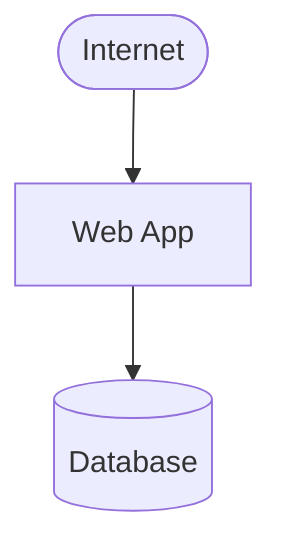
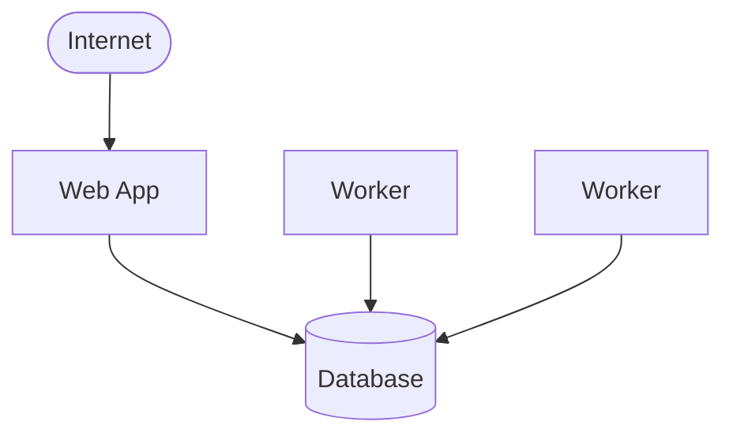
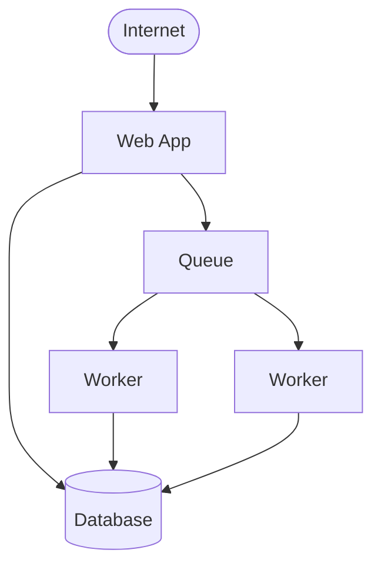
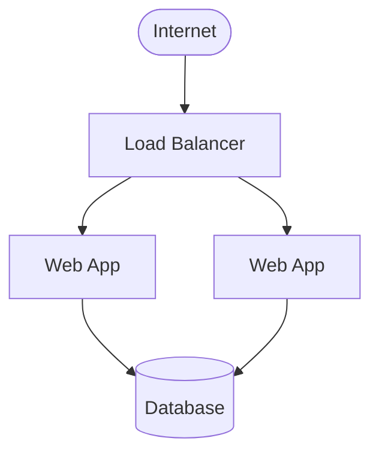
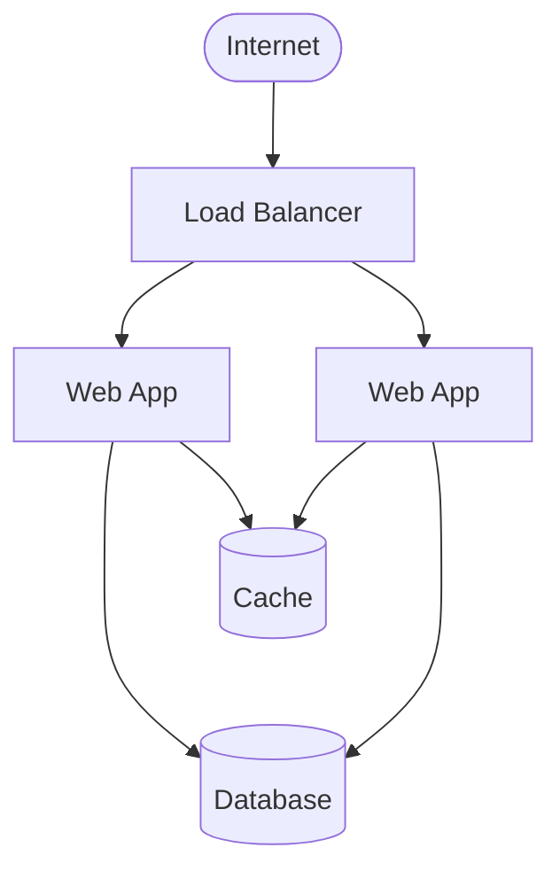
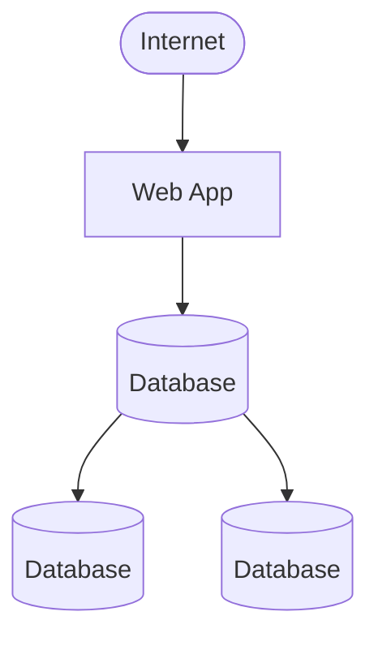
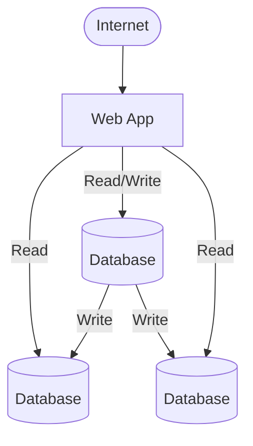
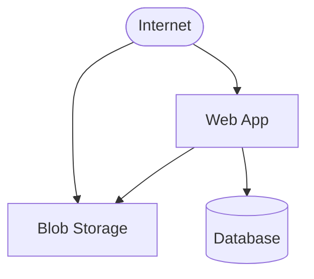
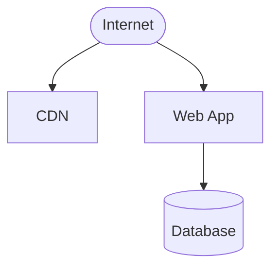

# Web Architecture 101

## Start

Start here. The bare minimum vanilla setup.  All state is persisted in the database.  The web app services requests from the Internet by reading from and writing to the database.

Depending on your situation, apply one or more of the following variations to the vanilla setup.  They're mostly orthogonal, so different variations can be combined.

## Variation 1

Add workers for background tasks.  This alleviates load on the web app.  The number of workers can be scaled with load.  The actual job queue can be stored in the database for simplicity.

Step 2: Add a separate queue to alleviate load on the database and get additional queuing features.

## Variation 2

Add a load balancer in front of multiple web app servers.  It's more redundant and scalable for high traffic.  This is also a bit more secure since the web app isn't exposed to the Internet.

Step 2: Add a cache server.  Soft state and computed values can be cached in memory to keep latency low.  But once you have multiple servers, you may want to share the cache using something like Redis.

## Variation 3

Add database replication.  This helps with availability since persistence is redundant.  If the primary database server goes down, one of the secondaries can immediately take its place.  More than one secondary can be used.  Replicas can be in different regions or availability zones.

Step 2: Add reading from replicas.  There are subtleties here and this may not work for every situation, but it's possible for the web app to read from replicas to reduce load on the primary database server.

## Variation 4

Add blob storage.  Think S3, but all cloud providers have an equivalent.  This is useful for larger files.  Splitting it out can alleviate load on both the database and the web app server since the web app doesn't need to store blobs in the database and clients can fetch directly from blob storage.

## Variation 5

Add a CDN for static assets.  This is useful for apps that are content-heavy or for SPAs.  If you have a mobile app with a cloud backend, a JS-heavy thick client is the most natural way to add a web interface that uses the same API as the mobile apps.  A CDN is similar to blob storage, but web apps don't typically write to the CDN.  It can be slower to update since it's distributed to many regions.

